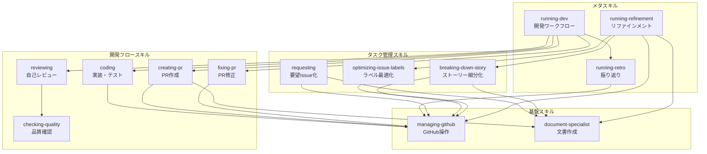
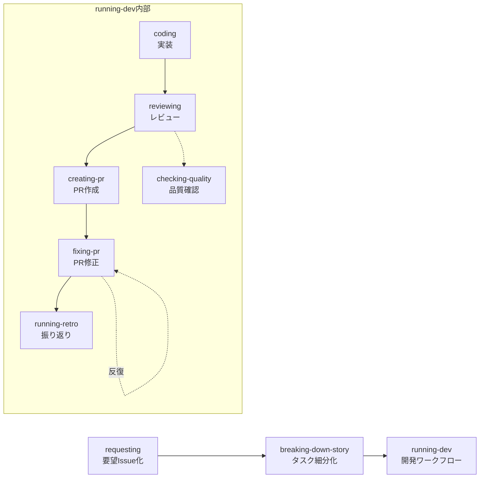
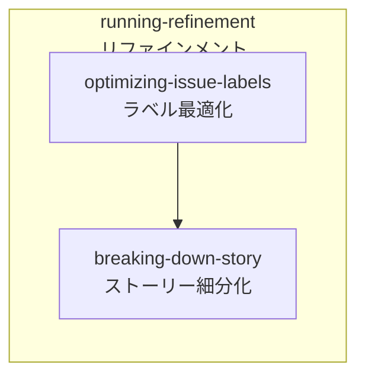

# スキルワークフロー

## 目的

このドキュメントは、13個のスキルの役割と呼び出し関係を整理し、開発ワークフローの全体像を図示することで、開発者がスキルを効果的に活用できるようにします。

## 前提知識

- スキルは `.claude/skills/` ディレクトリに定義されています
- 各スキルは `/スキル名` のコマンドで実行できます
- スキル間で相互に呼び出すことで複雑なワークフローを実現しています

## スキル一覧

### コアスキル

| スキル | コマンド | 役割 |
|-------|---------|------|
| managing-github | `/managing-github` | GitHub操作の基盤スキル。Issue、PR、スレッドの取得・作成・更新を担当 |
| coding | `/coding` | Issue内容を把握して実装・テスト・コミットを実行するメインのコーディングスキル |
| checking-quality | `/checking-quality` | ビルド、リント、フォーマット、テストを実行して品質を確認 |
| reviewing | `/reviewing` | コーディング規約、テスト、構造、ドキュメント品質の自己レビューを実行 |

### プルリクエストスキル

| スキル | コマンド | 役割 |
|-------|---------|------|
| creating-pr | `/creating-pr` | 修正内容をプルリクエストとして作成 |
| fixing-pr | `/fixing-pr` | PRのCI状態やレビューコメントに対応し、マージまで実行 |

### ストーリー・タスク管理スキル

| スキル | コマンド | 役割 |
|-------|---------|------|
| requesting | `/requesting` | ユーザー要望をstory/task Issueとして作成 |
| breaking-down-story | `/breaking-down-story` | ストーリーIssueを実装タスクに細分化してサブIssue化 |
| optimizing-issue-labels | `/optimizing-issue-labels` | Issueのstory/taskラベルを内容に基づいて最適化 |

### メタスキル

| スキル | コマンド | 役割 |
|-------|---------|------|
| running-dev | `/running-dev` | タスク実装から完了までの全体ワークフローを自動化するメタスキル |
| running-refinement | `/running-refinement` | バックログ全体のラベル最適化、ストーリー細分化、タスクアサインを一括実行 |
| running-retro | `/running-retro` | 作業セッションを振り返り、設定改善点を分析してIssue作成 |

## スキル間の依存関係

## 主要ワークフロー

### ワークフロー A: タスク実行フロー

新しいユーザー要望から実装完了までの完全なフローです。

**使用シーン:**
- ユーザーから新しい機能要望や改善提案があった場合
- `/requesting` でIssueを作成し、順次スキルを実行してタスクを完了させる

**実行手順:**
1. `/requesting` - ユーザー要望をIssue化
2. `/breaking-down-story` - ストーリーを実装可能なタスクに分解
3. `/running-dev` - タスクを実装してPRを作成し、マージまで完了

### ワークフロー B: リファインメントフロー

バックログ全体を整理し、タスクを準備するフローです。

**使用シーン:**
- 定期的なバックログ整理を行いたい場合
- 複数のストーリーをまとめて細分化したい場合

**実行手順:**
1. `/running-refinement` - 一括でバックログを整理
   - フェーズ1: ラベル最適化
   - フェーズ2: ストーリー細分化

## スキルの使い分け

### 単体スキルを使う場合

特定の作業だけを実行したい場合は、個別のスキルを使用します。

- `/coding` - Issue実装のみ実行
- `/reviewing` - レビューのみ実行
- `/creating-pr` - PR作成のみ実行
- `/breaking-down-story` - ストーリー細分化のみ実行
- `/checking-quality` - 品質確認のみ実行

### メタスキルを使う場合

複数の作業をまとめて実行したい場合は、メタスキルを使用します。

- `/running-dev` - タスク実装からマージまで一気通貫で実行
- `/running-refinement` - バックログ整理を一括実行
- `/running-retro` - セッション終了時の振り返り

## トラブルシューティング

### スキルの実行が失敗する

- `/managing-github` の認証情報を確認してください
- `.claude/skills/` 配下のSKILL.mdが正しく配置されているか確認してください

### ワークフローの途中で止まった

- 途中のスキルから再実行できます
- 例: `/running-dev` で `/reviewing` まで完了している場合、`/creating-pr` から再開可能

### 依存関係が複雑でわからない

- 本ドキュメントの依存関係図を参照してください
- わからない場合はメタスキル（`/running-dev`、`/running-refinement`）の使用を推奨

## 参考リンク

- [スキル定義](../.claude/skills/) - 各スキルの詳細な定義
- [CLAUDE.md](../.claude/CLAUDE.md) - プロジェクト全体の指示
